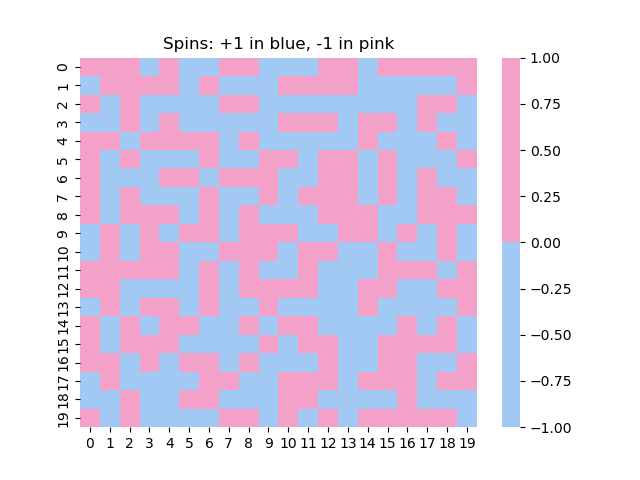
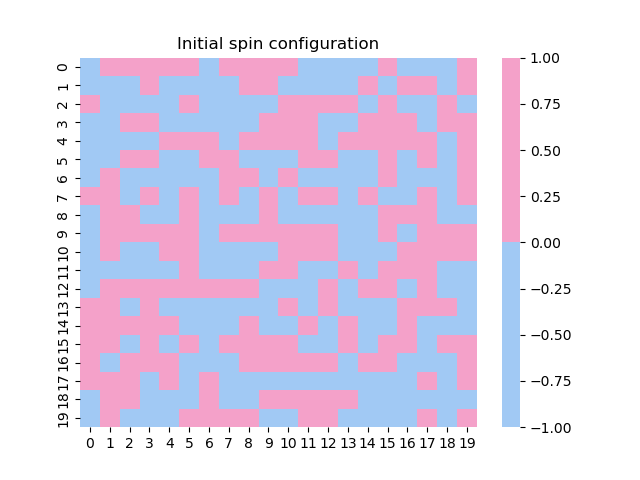
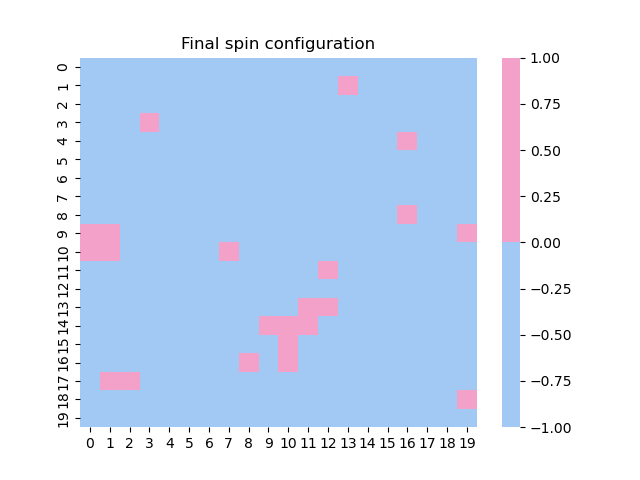
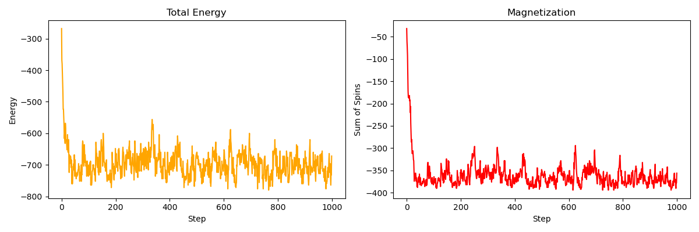

# 2D Ising Model using Metropolis-Hastings MCMC

## 1) CONTEXT: 2D Ising Model

What is our goal here?

In classical MCMC methods (such as in the previous MCMC lab), we want to sample according to a certain probability density. For example, we may want to generate points according to a function such as exp(−x²), instead of using a uniform distribution.

In the Ising model, it is similar.

We have a small material, like a magnet, and we want to study its microscopic properties through spins. We want to see how the atoms behave, and it is obvious that each atom influences the others. As a result, they interact with one another, which affects the energy of the system and its magnetization. These interactions also change depending on parameters such as temperature.

We can simulate this on a computer in the following way.

Imagine a grid like this:

```text
+1  -1  +1  -1
-1  -1  +1  +1
+1  +1  -1  -1
-1  +1  -1  +1
```

Each cell represents an atom in a material.

Each atom has a spin:

* +1 (up)
* -1 (down)

### What is the energy of a configuration?

It is a value that we calculate from the grid.

It depends on the alignment of neighboring spins:

* Two aligned neighbors (same sign) → low energy
* Two opposite neighbors → high energy

So:

* A well-aligned grid = lower energy
* A disordered grid = higher energy

### And now, why do we use MCMC here?

We are looking for the most probable spin configurations.

And guess what?

In nature (statistical physics), the most probable configurations are those with lower energy.

This is exactly what MCMC knows how to do:

Generate samples (here, spin grids) with a higher probability of visiting configurations that have lower energy.

| Simple MCMC                  | Ising Model with MCMC                          |
| ---------------------------- | ---------------------------------------------- |
| Generate x according to p(x) | Generate grids according to P(grid)            |
| Accept/reject x'             | Accept/reject a spin flip                      |
| Probability density p(x)     | Boltzmann density exp(-E/T)                    |
| Goal: explore ℝ              | Goal: explore the space of spin configurations |

A configuration is simply a spin grid (for example a 20×20 matrix containing +1 and -1 values).

Each configuration has an associated energy.

And we know (from Boltzmann) that the lower the energy of a configuration, the more probable it is at a given temperature.

The probability of a configuration C is:

P(C) ∝ exp(-E(C)/T)

This is nothing other than the Boltzmann distribution.

It has exactly the same form as the functions that we were sampling with MCMC before.

---

## MODELING THE SPIN LATTICE

The simulation starts by creating a lattice of spins.

Each site is randomly assigned either +1 or -1.

The lattice is then visualized using a heatmap.

A spin can also be manually modified in order to observe local changes in the system.

### Figures

#### Initial spin configuration



#### Modified spin configuration



---

## SIMULATION OF THE ISING MODEL USING THE METROPOLIS-HASTINGS MCMC ALGORITHM

### Objective

Simulate how spins evolve at temperature T while interacting with their neighbors in order to model ferromagnetism.

### Quick physical background

* Each spin takes the value +1 or -1.
* Each spin interacts with its 4 neighbors (up, down, left, right).
* The local energy is proportional to −J × (product of neighboring spins).
* J > 0 → spins want to align (ferromagnetism).
* At high temperature, spins are disordered.
* At low temperature, spins tend to align.
* There is a phase transition at a critical temperature Tc.

### Energy variation

Before using Metropolis, we first define the energy variation ΔE.

This quantity tells us how much the energy would change if a given spin were flipped.

### Metropolis-Hastings algorithm

For each Monte Carlo step:

1. Choose a random spin.
2. Compute the energy variation ΔE.
3. If ΔE ≤ 0, accept the flip.
4. Otherwise, accept it with probability:

exp(-ΔE/T)

In this way, lower-energy configurations are naturally favored while still allowing the system to explore different states.

### Observables

The simulation tracks two important quantities:

#### Total Energy

The total energy of the system is computed throughout the simulation.

#### Magnetization

The total magnetization is simply the sum of all spins.

It gives an idea of the global magnetic order of the system.

---

## RESULTS

### Final spin configuration



### Energy and magnetization evolution



The plots show how the total energy and the magnetization evolve during the simulation as the system approaches equilibrium.